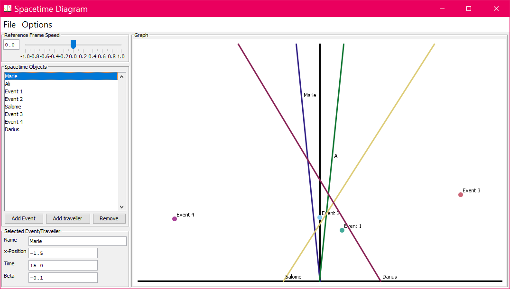

# Spacetime Diagram
### ***An interactive spacetime diagram to help understand special relativity***

## Downlad / Install
Go to [releases](https://github.com/JEElsner/Spacetime_Diagram/releases/) and download the latest version. Select `Spacetime_Diagram_vX.X.X.zip`. Once downloaded, unzip or extract the contents and run `SpacetimeDiagram.jar`.

## Use
The diagram window has four basic parts:
* The spacetime diagram itself on the right
* The 'Reference Frame Speed' on the top left
* The list of objects in the spacetime diagram on the middle left
* The properties of the selected object on the bottom left

The 'Reference Frame Speed' is the speed of the observer who would draw the spacetime diagram that is shown. This value, and all speeds in the program, are expressed as a fraction of the speed of light, and is called 'beta'. So a speed of 0.6 means that the observer is travelling at 0.6 times the speed of light, or approximately 1.9 million meters per second. Changing the reference frame speed will change how the lines are drawn on the diagram using [Lorentz Transformations](https://en.wikipedia.org/wiki/Lorentz_transformation).

### Diagram element Properties
Selecting an element of the spacetime diagram in the list at the left will reveal properties about the object in the box below, such as position, time, and speed (beta). These properties will for the current reference frame speed. In other words, what is entered in for the position or time is what the observer travelling at the 'reference frame speed' would observer of that event.

### Adding and removing elements
To add a new event (point in space and time), click the 'Add Event' button, then select the new event to change its properties. To add a new traveller or worldline (something that moves through space and time), click 'Add Traveller'. To remove both events and travellers, select the element in the list, and click 'Remove'.

### Additional Features
* The **File menu** contains options to save and open files containing the state of the spacetime diagram for editing later. It also contains an option to save the current state of the diagram as an image.
* The **Options menu** contains options to show a light cone emmanating from the origin; change the speed of light, altering the units of the properties of elements; and enable or disable the labelling of objects on the spacetime diagram.
